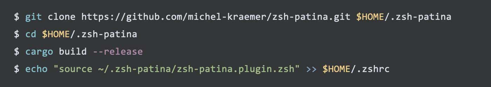

# zsh-patina

**$ A blazingly fast ZSH plugin performing syntax highlighting of your command line while you type 🌈**

The plugin spawns a tiny background daemon written in Rust. The daemon is shared between ZSH sessions and caches the syntax definition and color theme. Commands are highlighted in **less than a millisecond** (typically a few hundred microseconds, depending on the command's length).

Internally, the plugin uses [syntect](https://github.com/trishume/syntect/), which provides **high-quality syntax highlighting** based on [Sublime Text](https://www.sublimetext.com/) syntax definitions. The built-in theme uses the eight ANSI colors and is compatible with all terminal emulators.

In contrast to other ZSH syntax highlighters (e.g. [zsh-syntax-highlighting](https://github.com/zsh-users/zsh-syntax-highlighting/) or [fast-syntax-highlighting](https://github.com/zdharma-continuum/fast-syntax-highlighting)), which use different colors to indicate whether a command or a directory/file exists, zsh-patina performs **static highlighting that does not change while you type**. This way, you get a similar experience to editing code in your IDE.

## Example



## How to install

**Prerequisites:** At the moment, there are no pre-compiled binaries. You have to build the plugin yourself. For this, you require [Rust](https://rust-lang.org/) 1.94.0 or higher. The easiest way to install Rust is through [rustup](https://rustup.rs/).

1. Clone the repository:

   ```shell
   git clone https://github.com/michel-kraemer/zsh-patina.git $HOME/.zsh-patina
   ```

2. Build the plugin:

   ```shell
   cd $HOME/.zsh-patina
   cargo build --release
   ```

3. Add the plugin to the end of your `.zshrc` file:

   ```shell
   echo "source ~/.zsh-patina/zsh-patina.plugin.zsh" >> $HOME/.zshrc
   ```

4. Restart your terminal, or run:

   ```shell
   exec zsh
   ```

## How to remove the plugin

In the unlikely case you don't like zsh-patina ☹️, you can remove it as follows:

1. Remove the `source ~/.zsh-patina/...` line from your `.zshrc`.
2. Restart the terminal
3. Delete the directory where `zsh-patina` is installed:

   ```shell
   rm -rf $HOME/.zsh-patina
   ```

4. Delete the plugin's data directory:

   ```shell
   rm -rf $HOME/.local/share/zsh-patina/
   ```

## Contribute

I mostly built the plugin for myself because I wasn't satisfied with existing solutions (in terms of accuracy and performance). It doesn't have many features and is not particularly configurable yet. It does one job, and it does it well IMHO.

If you like the plugin and want to add a feature or found a bug, feel free to contribute. **Issue reports and pull requests are more than welcome!**

## License

zsh-patina is released under the **MIT license**. See the [LICENSE](LICENSE) file
for more information.
